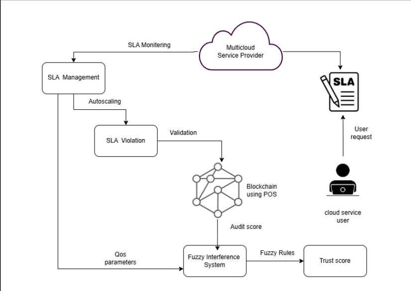
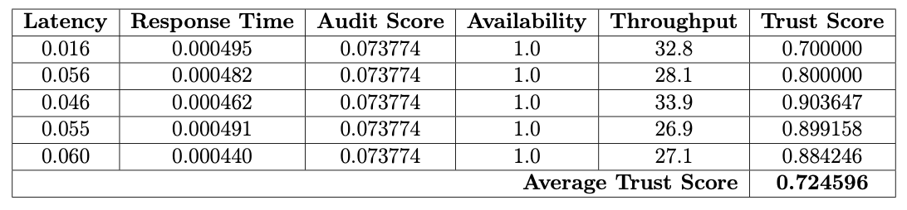
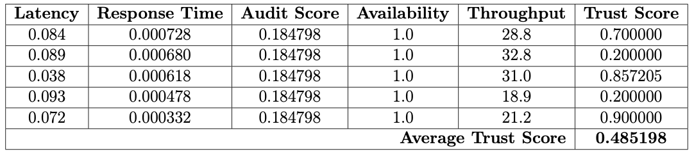
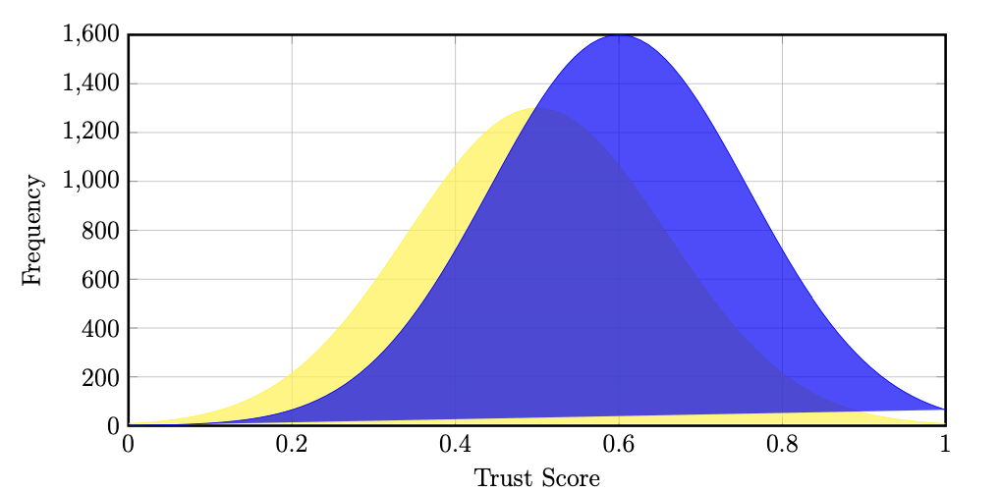
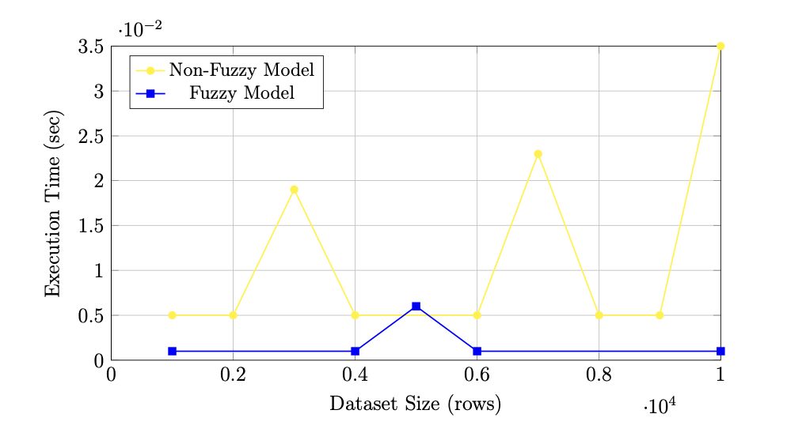
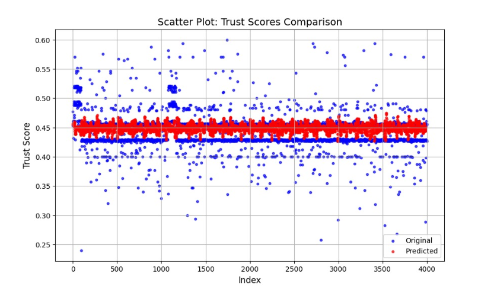
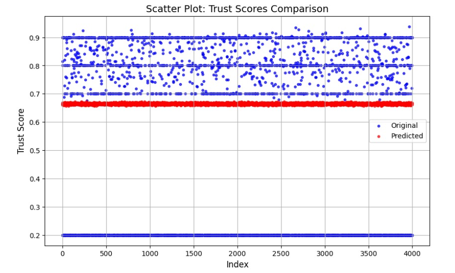

# Blockchain-Driven Trustworthy SLA Management with Proof of Stake Consensus in Multi-Cloud Environments

## **Introduction**
In today's rapidly evolving technological landscape, organizations increasingly rely on multi-cloud environments to achieve higher scalability, flexibility, and cost-effectiveness. However, managing Service Level Agreements (SLAs) across multiple Cloud Service Providers (CSPs) introduces challenges related to trust, transparency, and efficiency.

Traditional SLA management approaches are centralized, prone to inefficiencies, and lack transparency, leading to disputes and unreliable service quality. To address these challenges, this project proposes a blockchain-driven framework that integrates Proof of Stake (PoS) consensus and fuzzy logic to automate, secure, and improve SLA management in multi-cloud scenarios.

By leveraging blockchain’s decentralized and immutable ledger, this system ensures tamper-proof storage of SLA data and transparent enforcement. Meanwhile, the integration of a fuzzy inference system enables dynamic trust score calculation by handling uncertainties in cloud performance metrics such as availability, latency, throughput, autoscaling, and response time.

This approach empowers organizations to make informed decisions while selecting the most reliable CSP, reducing manual interventions, and enhancing overall trust in cloud-based services.

## **Problem Statement**
Organizations adopting multi-cloud environments face significant challenges in managing Service Level Agreements (SLAs), primarily due to the lack of transparency, centralized control mechanisms, and inefficiencies in traditional SLA monitoring. These centralized systems often fail to detect violations in real time and cannot effectively handle the uncertainty and variability in cloud service performance metrics. There is a need for a transparent, trustworthy, and automated SLA management framework that ensures secure validation, real-time monitoring, and reliable trust evaluation of cloud service providers.

## **Objectives**
1.To design and implement a blockchain-based framework for transparent and tamper-proof monitoring and enforcement of SLAs.  
2.To integrate an energy-efficient Proof of Stake (PoS) consensus mechanism for secure and fair validation of SLA-related transactions.  
3.To develop a fuzzy logic-based trust evaluation model capable of dynamically calculating trust scores for cloud service providers while effectively handling uncertainties in performance metrics.  
4.To automate SLA violation detection and compensation using smart contracts, reducing manual intervention and minimizing potential disputes.  
5.To evaluate and compare the performance of fuzzy logic-based and non-fuzzy trust models in terms of accuracy, scalability, and adaptability to large-scale multi-cloud data.  

## **Architecture**

  

The architecture of this system consists of three core components: Blockchain-based SLA management, Fuzzy Inference System (FIS), and the PoS consensus mechanism.  

**Blockchain-Based SLA Management**  
- SLA terms and service performance metrics are continuously recorded and verified using a decentralized blockchain ledger.  
- The blockchain ensures data immutability and transparency, preventing tampering or unauthorized changes to SLA records.  
- Autoscaling parameters such as CPU usage are stored securely on the blockchain, enabling audit score computation via smart contracts.

**Fuzzy Inference System (FIS)**  
- The FIS processes multiple Quality of Service (QoS) parameters — including availability, latency, throughput, and response time — to derive a comprehensive trust score.  
- Gaussian membership functions handle the uncertainties and fluctuations inherent in cloud environments, assigning dynamic trust scores to each CSP.  
- A rule-based system interprets the membership values to calculate final trust scores, aiding in optimal CSP selection.
  
**Proof of Stake (PoS) Consensus Mechanism**
- The PoS mechanism ensures energy-efficient, secure, and fair validation of SLA-related transactions on the blockchain.  
- Validators are selected based on stake, enabling rapid block confirmation without excessive computational power.  
- Honest validators are rewarded, while dishonest participants are penalized, promoting integrity and reliability in the system.

## **Methodology**

The proposed methodology integrates blockchain technology, a Proof of Stake (PoS) consensus mechanism, and fuzzy logic to enable trustworthy and automated Service Level Agreement (SLA) management in multi-cloud environments. This multi-layered approach addresses the limitations of traditional centralized SLA governance, ensuring transparency, data integrity, and adaptive decision-making.  
The methodology is designed in the following stages:  

**1. Data Collection and Preprocessing**  

Real-time Quality of Service (QoS) data is collected from Kubernetes and OpenStack cloud platforms. The dataset consists of 20,000 entries and includes critical parameters such as availability, latency, throughput, autoscaling (CPU utilization), and response time.  
To ensure consistency and quality of data, preprocessing steps are performed:
- Normalization: Metrics are scaled to a common range, typically [0, 1].  
- Percentage Conversion: Metrics expressed as percentages are converted to decimals.  
- Missing Value Handling: Missing or incomplete data is replaced using mean imputation.
  
**2. Secure Data Storage Using Blockchain**

Blockchain technology is employed to provide immutable and transparent storage for autoscaling parameters (specifically CPU utilization data). The decentralized ledger ensures that once the data is recorded, it cannot be modified or tampered with.  

The Proof of Stake consensus mechanism is used to validate and store this data on the blockchain. Validators are chosen based on their stake, and blocks are proposed, verified, and added only after achieving consensus among validators. This mechanism guarantees energy efficiency and fairness, unlike traditional Proof of Work systems.  

**3. Audit Score Computation**  

An audit score is computed to represent the overall performance of autoscaling in the cloud environment. After normalization, the mean of CPU utilization data is calculated to derive this score. The audit score is then stored securely on the blockchain, providing a transparent reference for further trust evaluation.  

**4. Trust Score Evaluation Using Fuzzy Logic**  

A Fuzzy Inference System (FIS) is designed to assess the trustworthiness of each cloud service provider dynamically.  

- **Membership Functions:** Gaussian membership functions are defined for each QoS parameter to model uncertainty and assign degrees of membership (low, medium, high).
- **Rule-Based Evaluation:** A set of fuzzy rules maps these membership values to corresponding trust scores. For example, high availability combined with low latency results in a high trust score, whereas low availability with high latency results in a low trust score.
- **Trust Score Aggregation:** Membership results are combined through defuzzification to generate a final trust score for each cloud service provider.

## **Implementation**
The implementation of the proposed framework transforms the conceptual methodology into a functional system capable of managing SLAs in a multi-cloud environment using blockchain, PoS consensus, and fuzzy logic.
The implementation process consists of multiple phases, each addressing a critical component of the system.

**Data Retrieval and Preprocessing**  
Datasets containing 20,000 entries are collected from Kubernetes and OpenStack. These datasets include metrics such as availability, latency, throughput, autoscaling (CPU utilization), and response time.
Preprocessing involves:
- Normalization: All QoS metrics are scaled to the range [0, 1] using min-max normalization:  
$x' = \frac{x - x_{\min}}{x_{\max} - x_{\min}}$  
- Conversion of percentages to decimals: For example, availability values expressed as percentages are converted to fractional values  (e.g., 95% → 0.95).  
- Handling missing data: Missing values are replaced using column-wise mean imputation to maintain consistency.  

**Blockchain Integration with Proof of Stake Consensus**  
The blockchain layer is implemented using Ethereum-compatible tools, such as Ganache for private blockchain simulation and MetaMask for wallet integration.
Validators are initialized, and a Proof of Stake mechanism is applied to store autoscaling data securely. The steps include:

- Validator selection based on stake.
- Block proposal containing autoscaling parameters.
- Validation by other nodes and consensus agreement.
- Reward and penalty assignment to encourage honest behavior.
- Appending validated blocks to the blockchain ledger.

**Audit Score Computation**  
An audit score is computed to evaluate the autoscaling performance (CPU utilization) for each CSP. The computation involves:

- Normalization of CPU utilization values using min-max scaling.
- Calculation of the audit score (S) as the mean of normalized autoscaling data:  
$S = \frac{1}{n}\sum_{i=1}^{n} x_i$  
where $x_i$ represents each normalized CPU utilization value, and $n$ is the total number of observations.
This audit score $S$ is then stored on the blockchain, providing a transparent and immutable performance record.

**Fuzzy Logic-Based Trust Score Calculation**  
A Fuzzy Inference System (FIS) is implemented using Python, leveraging numerical libraries for efficient computation.

Gaussian Membership Function
For each QoS parameter, Gaussian membership functions are defined to evaluate degrees of membership for categories such as low, medium, and high. The membership function is defined as:  
$\mu(x) = \exp\left(-\frac{1}{2}\left(\frac{x - \mu}{\sigma}\right)^2\right)$  

where:
- x is the input QoS parameter value.
- μ is the mean of the parameter.
- σ is the standard deviation.
Membership values are computed for each QoS parameter: availability, latency, throughput, autoscaling, and response time.

**Rule-Based Trust Assignment**  
A set of fuzzy rules is used to interpret the membership degrees and assign a corresponding trust value. Examples include:  
- If availability is high and latency is low, then trust score = 0.9.  
- If availability is low and latency is high, then trust score = 0.2.  
- If throughput is high and latency is medium, then trust score = 0.7.  
Rules are evaluated sequentially, and the first matching rule determines the trust value for that observation.

**Aggregation and Defuzzification**  
The final trust score for each CSP is computed by aggregating individual metric evaluations. Defuzzification (weighted combination) is performed to obtain a crisp value:  
$T = \frac{\sum_{i=1}^{m} w_i \cdot t_i}{\sum_{i=1}^{m} w_i}$

where:  

- $T$ is the final trust score.  
- $t_i$ is the trust score assigned by each rule.  
- $w_i$ is the weight assigned to each metric or rule (can be equal or based on priority).

**Smart Contract Development**  
Smart contracts are developed using Solidity to handle storage and validation of autoscaling data and audit scores on the blockchain. The contracts ensure:

- Only validated transactions can record data.  
- Enforcement logic for SLA violations.  
- Automatic computation and logging of audit scores.

**Evaluation and Performance Analysis**  
The system is tested on real and synthetic datasets to assess:

- Trust score distribution: Comparisons are made between fuzzy and non-fuzzy models to demonstrate flexibility and accuracy.
- Execution time: The scalability of the fuzzy logic approach is evaluated by measuring execution time over different dataset sizes.
- Predictive accuracy: LSTM-based models are used to compare predicted trust scores with original computed scores to validate forecasting ability.

## **Results and Discussion**
The proposed framework was evaluated on a dataset comprising 20,000 records collected from Kubernetes and OpenStack cloud platforms. Various Quality of Service (QoS) metrics such as availability, latency, throughput, autoscaling (CPU utilization), and response time were analyzed.

The results demonstrate the effectiveness of integrating blockchain-based audit scores, Proof of Stake (PoS) consensus, and fuzzy logic for dynamic trust evaluation. The following subsections describe the experimental setup, trust score computation, comparative analysis, and predictive evaluation in detail.  

## **Experimental Setup**
The experiments were conducted using real-time datasets from Kubernetes and OpenStack. Metrics were preprocessed through normalization and imputation as necessary. The blockchain layer was simulated using Ganache and smart contracts developed in Solidity were deployed to handle autoscaling data and audit score storage.

The fuzzy inference system was implemented in Python using libraries such as NumPy and SciPy. Gaussian membership functions were used to evaluate metric uncertainties, and a rule-based system was defined to assign trust scores.  

## **Trust Score Calculation**
Trust scores for each cloud service provider (CSP) were computed using the fuzzy logic-based approach.

  

  

## **Comparison of Fuzzy and Non-Fuzzy Approaches**
The fuzzy logic-based model was compared against a traditional non-fuzzy approach where trust scores were computed using a weighted sum of normalized metrics without accounting for uncertainty.  

  

- Fuzzy Approach: Provided smooth transitions in trust scores, allowing for more flexible and realistic trust evaluation under varying network and performance conditions.
- Non-Fuzzy Approach: Resulted in rigid, deterministic trust scores lacking adaptability to minor fluctuations and uncertainties in real-time data.
A histogram of trust score distributions showed that the fuzzy model had a wider and smoother spread, capturing different levels of CSP reliability more effectively.

## **Execution Time Analysis**
An analysis of execution time for both fuzzy and non-fuzzy models over varying dataset sizes demonstrated that the fuzzy model maintained lower and stable execution times as data volume increased.  

  

  
This indicates superior scalability and efficiency, making it suitable for real-world large-scale multi-cloud environments.  

## **Predicted vs Original Trust Scores**
To evaluate predictive accuracy, an LSTM-based model was used to forecast trust scores based on input QoS metrics.

**OpenStack**
- Original Scores: Ranged widely between approximately 0.25 and 0.60, reflecting real operational variations.
- Predicted Scores: Tended to cluster around 0.45, failing to fully capture extreme values and outliers.
  

  

   

**Kubernetes**
- Original Scores: Showed higher variability, including scores above 0.8 and as low as 0.2.
- Predicted Scores: Overpredicted low trust cases and underpredicted high trust cases, resulting in a more compressed range.

  

  

These observations highlight the need for enhancing predictive model sensitivity to better represent real-world dynamics.

## **Overall Discussion**
The experimental results validate that the proposed framework successfully integrates blockchain-based transparent storage, energy-efficient PoS consensus, and adaptive fuzzy logic to improve SLA management in multi-cloud environments.  

- The fuzzy approach excels at handling uncertainties inherent in cloud performance metrics.  
- The use of PoS ensures fair and secure storage of critical autoscaling data with lower energy consumption.  
- Trust scores computed using this hybrid approach provide a strong basis for selecting the most reliable cloud service providers.  

## **Summary**
The results confirm the effectiveness and practical feasibility of the proposed framework. The system offers an advanced, trustworthy, and scalable solution for SLA evaluation and CSP selection, promoting transparency and efficiency in multi-cloud service environments.
